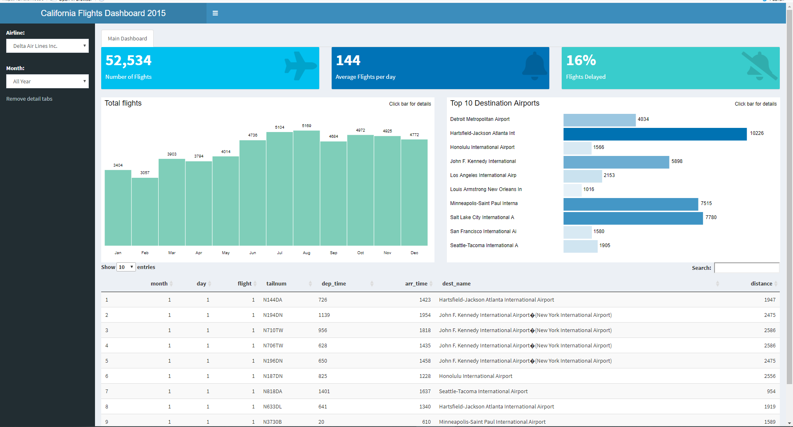

# caflights15
A shiny project containing all out-bound flights from california in 2015 + useful metdata

This dashboard contains information about all flights that departed from California (e.g. LAX, SFO, SAN, OAK, e.t.c) to destinations in the United States, Puerto Rico, and the American Virgin Islands) in 2015: 674,000+ flights in total, with an average of 1850 flown from california daily and 19% delay of the total flight. To help understand what causes delays, it also includes a number of other useful datasets.

Interfacing with the database

Export the data from the database and created a dashboard with it

This dashboard is connected to the MySQL schema and provides the following data tables.

- flights: all flights that departed from california in 2015
- planes: construction information about each plane
- airports: airport names and locations
- airlines: translation between two letter carrier codes and names

