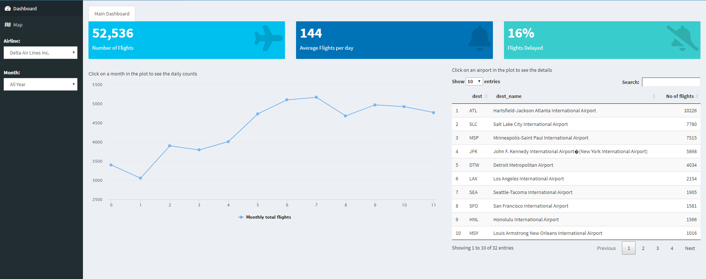
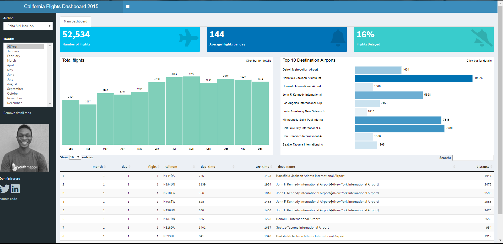

# caflights15
A shiny project containing all out-bound flights from california in 2015 + useful metdata

This dashboard contains information about all flights that departed from California (e.g. LAX, SFO, SAN, OAK, e.t.c) to destinations in the United States, Puerto Rico, and the American Virgin Islands) in 2015: 674,000+ flights in total, with an average of 1850 flown from california daily and 19% delay of the total flight. To help understand what causes delays, it also includes a number of other useful datasets.

Interfacing with the database

Export the data from the database and created a dashboard with it

This dashboard is connected to the MySQL schema and provides the following data tables.

## Relational Data model
The relational model for this project represents the database of the datasets as collection of relations(tables of values). Every row in the table represents a collection of related data values.

In the relational model the, relations are saved in the table format. It is stored along its entities. A table has two properties rows and columns. Rows represents records and columns represents attributes. The following are the tables used in this project.

- caflights15: all flights that departed from california in 2015
- airports: airport names and locations
- airlines: translation between two letter carrier codes and names

Check out the live demo of the web app - https://denironyx.shinyapps.io/caflights15/
